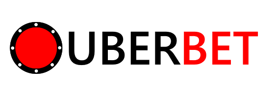

# Projet de NoSql

> 

#### But du projet :
Application web qui communique avec 2 bases de données différentes

#### Techno utilisées :
##### Partie serveur / Back-End : 
###### - Serveur apache2
  - Serveur (serveur web)
###### - Flask
  - Framework (micro framework)
###### - WSGI (Web Server Gateway Interface)
  - Lien entre le serveur et le framework
###### - Postgres
  - Base de donnée (gestionnaire de base de données relationnelle)
###### - Redis
  - Base de donnée (gestionnaire de base de données clé-valeur)
##### Partie static / Front-End : 
- HTML5 - CSS3 - JS9 (classique)

Flask va communiquer avec les bases de données pour les lier avec le front

#### But de l'application :
A l'arrivée sur le site, la première étape est de s'inscrire puis se connecter (ou de se connecter directement si c'est déjà fait).

Une fois la connexion effectuée, vous allez être redirigé vers la page de jeu.

Le jeu consiste à parier sur une des 4 cartes disponibles un nombre de jetons puis de lancer le jeu.

Lors de la première connexion le joueur aura 100 jetons ajoutés directement sur son compte.

Si le joueur tombe à court de jetons, il pourra en acheter gratuitement en cliquant sur le compteur de jetons présent en haut à droite.

# HAVE FUN !